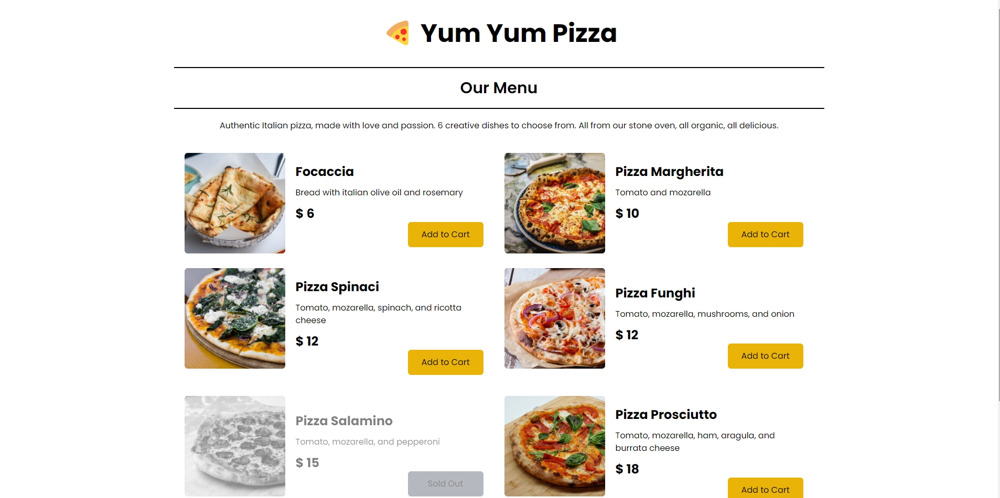

# Yum Yum Pizza
"Yum Yum Pizza" is a beautifully designed restaurant website that showcases a menu for a fictional pizza restaurant. 

## Learning Objectives
The main goals of the website was to learn more about
 - How to create and structure React components 
 - How to pass props from parent components to child components
 - How to use Tailwind CSS to style a React application.

## Technologies
This website was built using React and Tailwind CSS.